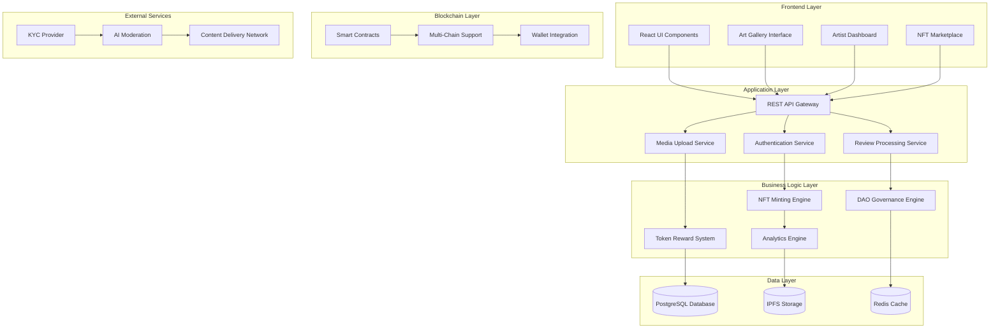

# Design Document: Art Module NFT Platform

## Overview

The Art Module NFT Platform is a comprehensive digital art ecosystem within Creaverse DAO that enables artists to mint NFT collections, collectors to discover and purchase art, and community members to earn CreovateDAO Tokens through meaningful participation. The platform combines blockchain technology, AI-powered moderation, and community governance to create a trusted digital art economy.

## Architecture

### High-Level System Architecture



### Component Architecture

The system follows a modular microservices architecture with clear separation of concerns:

1. **Frontend Layer**: React-based user interfaces for different user types
2. **API Gateway**: Centralized request routing and authentication
3. **Business Services**: Core platform functionality as independent services
4. **Data Layer**: Persistent storage with caching for performance
5. **Blockchain Integration**: Multi-chain NFT support with smart contracts
6. **External Integrations**: Third-party services for specialized functionality

## Components and Interfaces

### 1. Artist Onboarding Service

**Purpose**: Manages artist registration, KYC verification, and profile creation.

**Key Components**:
- Registration Controller
- KYC Integration Module
- Profile Management System
- Verification Badge Generator

**Interfaces**:
```typescript
interface ArtistOnboardingService {
  registerArtist(artistData: ArtistRegistration): Promise<Artist>
  initiateKYC(artistId: string, documents: KYCDocuments): Promise<VerificationStatus>
  updateProfile(artistId: string, profile: ArtistProfile): Promise<Artist>
  getVerificationStatus(artistId: string): Promise<VerificationStatus>
}

interface ArtistRegistration {
  email: string
  displayName: string
  bio: string
  socialLinks: SocialLinks
  kycEnabled: boolean
}
```

### 2. NFT Minting Engine

**Purpose**: Handles NFT collection creation, metadata management, and blockchain minting.

**Key Components**:
- Collection Builder
- Metadata Generator
- Multi-Chain Minting Service
- Royalty Contract Deployer

**Interfaces**:
```typescript
interface NFTMintingEngine {
  createCollection(artistId: string, collection: CollectionData): Promise<Collection>
  mintNFTs(collectionId: string, artworks: ArtworkData[]): Promise<NFT[]>
  deployRoyaltyContract(collection: Collection): Promise<SmartContract>
  updateMetadata(nftId: string, metadata: NFTMetadata): Promise<NFT>
}

interface CollectionData {
  title: string
  description: string
  itemCount: number
  pricingModel: PricingModel
  blockchain: BlockchainNetwork
  royaltyPercentage: number
  collaborators?: string[]
}
```

### 3. Art Gallery and Marketplace

**Purpose**: Provides public art discovery, filtering, and purchasing functionality.

**Key Components**:
- Gallery Display Engine
- Search and Filter System
- Purchase Processing Service
- Auction Management System

**Interfaces**:
```typescript
interface ArtGalleryService {
  getArtworks(filters: GalleryFilters): Promise<Artwork[]>
  getArtworkDetails(artworkId: string): Promise<ArtworkDetails>
  searchArtworks(query: string, filters: SearchFilters): Promise<Artwork[]>
  getFeaturedArtworks(): Promise<Artwork[]>
}

interface MarketplaceService {
  purchaseNFT(nftId: string, payment: PaymentData): Promise<Transaction>
  placeBid(auctionId: string, bid: BidData): Promise<Bid>
  processRoyalties(transaction: Transaction): Promise<RoyaltyDistribution>
}
```

### 4. Review and Critique System

**Purpose**: Manages community reviews, validation, and quality assessment.

**Key Components**:
- Review Submission Handler
- AI Content Moderation
- Community Validation Engine
- Helpfulness Voting System

**Interfaces**:
```typescript
interface ReviewSystem {
  submitReview(userId: string, artworkId: string, review: ReviewData): Promise<Review>
  validateReview(reviewId: string): Promise<ValidationResult>
  voteOnHelpfulness(reviewId: string, userId: string, helpful: boolean): Promise<Vote>
  getFeaturedReviews(artworkId: string): Promise<Review[]>
}

interface ReviewData {
  conceptUnderstanding: string
  techniqueExecution: string
  creativity: string
  emotionalImpact: string
  constructiveFeedback: string
  overallRating: number
}
```

### 5. Token Reward System

**Purpose**: Calculates and distributes CreovateDAO Tokens for platform participation.

**Key Components**:
- Reward Calculator
- Distribution Engine
- Anti-Abuse Detection
- Milestone Tracker

**Interfaces**:
```typescript
interface TokenRewardSystem {
  calculateRewards(activity: PlatformActivity): Promise<RewardCalculation>
  distributeTokens(userId: string, amount: number, reason: string): Promise<TokenDistribution>
  detectAbuse(activity: PlatformActivity): Promise<AbuseDetection>
  trackMilestones(artistId: string): Promise<Milestone[]>
}

interface RewardCalculation {
  baseReward: number
  bonusMultiplier: number
  finalAmount: number
  reason: string
}
```

### 6. DAO Governance Engine

**Purpose**: Manages community voting, proposals, and platform governance.

**Key Components**:
- Proposal Management System
- Voting Mechanism
- Result Calculation Engine
- Governance Token Integration

**Interfaces**:
```typescript
interface DAOGovernanceEngine {
  createProposal(proposer: string, proposal: ProposalData): Promise<Proposal>
  castVote(proposalId: string, voter: string, vote: VoteChoice): Promise<Vote>
  executeProposal(proposalId: string): Promise<ExecutionResult>
  getGovernanceStats(): Promise<GovernanceStats>
}
```

## Data Models

### Core Entities

```typescript
// Artist Entity
interface Artist {
  id: string
  email: string
  displayName: string
  bio: string
  profileImage: string
  isVerified: boolean
  kycStatus: KYCStatus
  socialLinks: SocialLinks
  collections: Collection[]
  totalSales: number
  tokensEarned: number
  createdAt: Date
  updatedAt: Date
}

// NFT Collection Entity
interface Collection {
  id: string
  artistId: string
  title: string
  description: string
  coverImage: string
  itemCount: number
  mintedCount: number
  pricingModel: PricingModel
  blockchain: BlockchainNetwork
  contractAddress: string
  royaltyPercentage: number
  collaborators: string[]
  status: CollectionStatus
  createdAt: Date
}

// NFT Artwork Entity
interface NFT {
  id: string
  collectionId: string
  tokenId: string
  title: string
  description: string
  imageUrl: string
  metadata: NFTMetadata
  currentOwner: string
  ownershipHistory: OwnershipRecord[]
  price: number
  currency: string
  isForSale: boolean
  reviews: Review[]
  averageRating: number
  viewCount: number
  createdAt: Date
}

// Review Entity
interface Review {
  id: string
  artworkId: string
  reviewerId: string
  conceptUnderstanding: string
  techniqueExecution: string
  creativity: string
  emotionalImpact: string
  constructiveFeedback: string
  overallRating: number
  helpfulnessVotes: number
  isFeatured: boolean
  status: ReviewStatus
  tokensEarned: number
  createdAt: Date
}

// Token Reward Entity
interface TokenReward {
  id: string
  userId: string
  amount: number
  reason: string
  activityType: ActivityType
  activityId: string
  status: RewardStatus
  distributedAt: Date
}
```

### Enums and Types

```typescript
enum KYCStatus {
  NOT_STARTED = 'not_started',
  IN_PROGRESS = 'in_progress',
  APPROVED = 'approved',
  REJECTED = 'rejected'
}

enum PricingModel {
  FIXED_PRICE = 'fixed_price',
  AUCTION = 'auction',
  DUTCH_AUCTION = 'dutch_auction'
}

enum BlockchainNetwork {
  ETHEREUM = 'ethereum',
  POLYGON = 'polygon',
  SOLANA = 'solana',
  BINANCE_SMART_CHAIN = 'bsc'
}

enum ReviewStatus {
  PENDING = 'pending',
  APPROVED = 'approved',
  REJECTED = 'rejected',
  FEATURED = 'featured'
}

enum ActivityType {
  ARTWORK_MINT = 'artwork_mint',
  REVIEW_SUBMISSION = 'review_submission',
  HELPFUL_VOTE = 'helpful_vote',
  MILESTONE_ACHIEVEMENT = 'milestone_achievement'
}
```

## Correctness Properties

*A property is a characteristic or behavior that should hold true across all valid executions of a system—essentially, a formal statement about what the system should do. Properties serve as the bridge between human-readable specifications and machine-verifiable correctness guarantees.*

<function_calls>
<invoke name="prework">
<parameter name="featureName">art-module-nft-platform

### Property Reflection

After analyzing all acceptance criteria, I identified several areas where properties can be consolidated for more comprehensive testing:

- **Registration and KYC properties** can be combined into comprehensive user onboarding validation
- **Collection creation and minting properties** can be unified into NFT lifecycle management
- **Marketplace and payment properties** can be consolidated into transaction integrity validation
- **Review system properties** can be combined into content validation and reward distribution
- **Token reward properties** can be unified into comprehensive reward system validation

### Correctness Properties

Based on the prework analysis, the following properties ensure system correctness:

**Property 1: Artist Registration and Verification Integrity**
*For any* artist registration attempt, the system should provide KYC toggle option, and when KYC is enabled, should collect documents, verify authenticity, and issue verified badges upon completion
**Validates: Requirements 1.1, 1.2, 1.3**

**Property 2: NFT Collection Creation Completeness**
*For any* NFT collection creation, the system should require all mandatory fields (title, description, item count), support all pricing models (Fixed, Auction, Dutch Auction), and successfully mint NFTs on the selected blockchain with complete ownership tracking
**Validates: Requirements 2.1, 2.2, 2.3, 2.4, 2.5**

**Property 3: Dashboard Data Accuracy**
*For any* artist dashboard access, the displayed sales revenue and token earnings should accurately reflect the artist's actual performance and milestone achievements
**Validates: Requirements 3.1, 3.2**

**Property 4: Gallery and Marketplace Functionality**
*For any* gallery browsing session, all available NFT collections should be displayed, all filter options should work correctly, and the marketplace should support multiple payment methods with atomic ownership transfers
**Validates: Requirements 4.1, 4.2, 5.1, 5.2**

**Property 5: Review System Validation**
*For any* review submission, the system should enforce artwork viewing prerequisites, require all structured fields, validate minimum word counts, and prevent spam through AI and community moderation
**Validates: Requirements 6.1, 6.2, 6.3**

**Property 6: Token Reward Distribution Integrity**
*For any* platform activity that qualifies for rewards, the system should automatically distribute CreovateDAO Tokens for milestones and validated reviews while preventing rewards for detected abuse
**Validates: Requirements 7.1, 7.2, 7.3**

**Property 7: DAO Governance Functionality**
*For any* governance proposal or voting activity, the system should enable community participation through transparent proposal and voting mechanisms
**Validates: Requirements 8.1**

**Property 8: Security and Trust Verification**
*For any* smart contract deployment or ownership verification, the system should ensure transparency, auditability, and provide on-chain proof of NFT authenticity
**Validates: Requirements 9.1, 9.2**

**Property 9: User Interface Workflow Consistency**
*For any* user interaction with upload and minting processes, the system should provide guided workflows with progress indicators and maintain responsive functionality
**Validates: Requirements 10.2**

**Property 10: Analytics Data Completeness**
*For any* analytics query, the system should track and display complete performance metrics, sales trends, engagement data, and marketplace health indicators
**Validates: Requirements 11.1**

## Error Handling

### Error Classification and Response Strategy

**1. User Input Errors**
- Invalid file formats during artwork upload
- Missing required fields in collection creation
- Insufficient funds for NFT purchase
- Response: Clear validation messages with corrective guidance

**2. Blockchain Integration Errors**
- Network congestion causing transaction delays
- Smart contract deployment failures
- Insufficient gas fees for minting
- Response: Retry mechanisms with user notification and alternative options

**3. External Service Failures**
- KYC provider service unavailability
- IPFS storage connection issues
- Payment processor downtime
- Response: Graceful degradation with fallback services and user communication

**4. System Performance Errors**
- Database connection timeouts
- High load causing slow response times
- Memory limitations during large file uploads
- Response: Load balancing, caching strategies, and progressive upload handling

**5. Security and Fraud Detection**
- Suspicious review patterns indicating spam
- Potential NFT counterfeiting attempts
- Unusual token reward claiming behavior
- Response: Automated flagging, manual review processes, and temporary restrictions

### Error Recovery Mechanisms

```typescript
interface ErrorRecoveryStrategy {
  retryPolicy: RetryConfiguration
  fallbackService: string
  userNotification: NotificationStrategy
  escalationPath: EscalationLevel[]
}

interface RetryConfiguration {
  maxAttempts: number
  backoffStrategy: 'exponential' | 'linear' | 'fixed'
  baseDelay: number
  maxDelay: number
}
```

## Testing Strategy

### Dual Testing Approach

The Art Module requires both unit testing and property-based testing to ensure comprehensive coverage:

**Unit Tests**: Verify specific examples, edge cases, and error conditions
- Individual component functionality
- API endpoint responses
- Database operations
- Smart contract interactions

**Property Tests**: Verify universal properties across all inputs
- System behavior consistency
- Data integrity maintenance
- Business rule enforcement
- Security constraint validation

### Property-Based Testing Configuration

**Testing Framework**: QuickCheck for TypeScript/JavaScript
**Test Iterations**: Minimum 100 iterations per property test
**Test Environment**: Isolated test blockchain networks for NFT operations

Each property test must reference its design document property:
- **Tag Format**: `Feature: art-module-nft-platform, Property {number}: {property_text}`

### Testing Priorities

**Critical Path Testing**:
1. NFT minting and ownership transfer integrity
2. Token reward calculation and distribution accuracy
3. Review validation and anti-abuse mechanisms
4. Payment processing and royalty distribution
5. Smart contract deployment and execution

**Integration Testing**:
1. End-to-end artist onboarding flow
2. Complete NFT purchase journey
3. Review submission to token reward pipeline
4. DAO governance proposal lifecycle
5. Multi-blockchain NFT operations

**Performance Testing**:
1. High-volume NFT minting operations
2. Concurrent marketplace transactions
3. Large-scale review processing
4. Analytics query performance under load
5. IPFS storage and retrieval efficiency

### Security Testing

**Smart Contract Auditing**:
- Automated vulnerability scanning
- Manual code review by security experts
- Formal verification of critical functions
- Gas optimization analysis

**Platform Security Testing**:
- Authentication and authorization validation
- Input sanitization and injection prevention
- Rate limiting and DDoS protection
- Data encryption and privacy compliance

## Implementation Considerations

### Scalability Architecture

**Horizontal Scaling**:
- Microservices deployment with container orchestration
- Database sharding for user and NFT data
- CDN integration for artwork image delivery
- Load balancing across multiple regions

**Performance Optimization**:
- Redis caching for frequently accessed data
- Database indexing for complex queries
- Lazy loading for large artwork collections
- Background processing for token rewards

### Blockchain Integration Strategy

**Multi-Chain Support**:
- Abstraction layer for different blockchain protocols
- Unified wallet integration across networks
- Cross-chain NFT bridging capabilities
- Gas fee optimization and estimation

**Smart Contract Architecture**:
- Upgradeable proxy patterns for contract evolution
- Modular contract design for specific functionalities
- Emergency pause mechanisms for security incidents
- Comprehensive event logging for transparency

### Data Privacy and Compliance

**GDPR Compliance**:
- User consent management for data collection
- Right to erasure implementation (where blockchain permits)
- Data portability for user-generated content
- Privacy-by-design architecture principles

**Content Moderation**:
- AI-powered content analysis for inappropriate material
- Community reporting and flagging systems
- Human moderator review workflows
- Appeals process for content decisions

This comprehensive design provides the foundation for building a robust, scalable, and secure Art Module that serves artists, collectors, and the broader Creaverse DAO community while maintaining the highest standards of quality and trust.