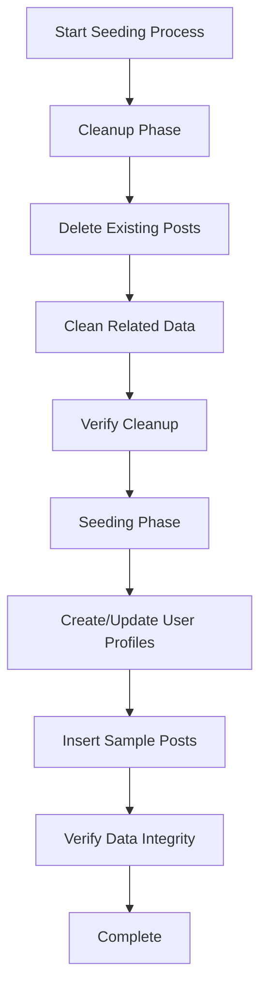

# Design Document

## Overview

This design outlines the implementation approach for seeding the Creaverse database with representative sample posts for each creative community. The solution will provide a clean, consistent demonstration experience by replacing existing posts with carefully crafted sample content that showcases the platform's diverse creative communities.

## Architecture

### Database Seeding Strategy

The seeding process will follow a two-phase approach:

1. **Cleanup Phase**: Remove existing posts and related data
2. **Seeding Phase**: Insert new sample posts with associated profiles

### Data Flow



## Components and Interfaces

### 1. Database Seeding Service

**Purpose**: Orchestrates the entire seeding process

**Key Methods**:
- `cleanupExistingData()`: Removes existing posts and related data
- `seedSamplePosts()`: Creates sample posts for each community
- `verifyDataIntegrity()`: Validates the seeded data

### 2. Sample Data Generator

**Purpose**: Generates high-quality sample content for each creative community

**Key Methods**:
- `generateCinemaPost()`: Creates cinema community sample post
- `generateArtPost()`: Creates art community sample post
- `generateTechPost()`: Creates tech community sample post
- `generateBooksPost()`: Creates books community sample post
- `generateNaturePost()`: Creates nature community sample post
- `generateMusicPost()`: Creates music community sample post

### 3. User Profile Manager

**Purpose**: Creates or updates user profiles to serve as post authors

**Key Methods**:
- `createSampleProfile(community, profileData)`: Creates community-specific user profile
- `updateProfileMetrics(userId, metrics)`: Updates engagement metrics

## Data Models

### Sample Post Structure

```typescript
interface SamplePost {
  id: string;
  author_id: string;
  content: string;
  category: CreatorType;
  media_type: MediaType;
  media_url: string;
  thumbnail_url?: string;
  tags: string[];
  is_published: boolean;
  is_tokenized: boolean;
  token_reward: number;
  likes_count: number;
  comments_count: number;
  shares_count: number;
  created_at: string;
}
```

### Sample User Profile Structure

```typescript
interface SampleProfile {
  id: string;
  username: string;
  display_name: string;
  bio: string;
  avatar_url?: string;
  is_verified: boolean;
  creator_types: CreatorType[];
  followers_count: number;
  following_count: number;
  tokens_earned: number;
  tokens_balance: number;
  reputation: number;
}
```

## Sample Content Specifications

### Cinema Community Post
- **Content**: Independent film project announcement
- **Media Type**: Video (with high-quality thumbnail)
- **Media URL**: Cinematic poster or film still from Unsplash
- **Tags**: ["indiefilm", "cinema", "storytelling", "filmmaking"]
- **Token Reward**: 200 tokens
- **Engagement**: 156 likes, 34 comments, 28 shares

### Art Community Post
- **Content**: Digital art collection drop announcement
- **Media Type**: Image
- **Media URL**: Abstract digital artwork from Unsplash
- **Tags**: ["digitalart", "nft", "artwork", "collection"]
- **Token Reward**: 300 tokens
- **Engagement**: 289 likes, 67 comments, 45 shares

### Tech Community Post
- **Content**: Open-source project release announcement
- **Media Type**: Image
- **Media URL**: Code/technology concept image from Unsplash
- **Tags**: ["opensource", "webdev", "programming", "javascript"]
- **Token Reward**: 150 tokens
- **Engagement**: 198 likes, 42 comments, 31 shares

### Books Community Post
- **Content**: Book review or literary discussion
- **Media Type**: Image
- **Media URL**: Book/reading-related image from Unsplash
- **Tags**: ["literature", "reading", "bookclub", "review"]
- **Token Reward**: 100 tokens
- **Engagement**: 134 likes, 28 comments, 19 shares

### Nature Community Post
- **Content**: Environmental conservation project
- **Media Type**: Image
- **Media URL**: Nature/environmental image from Unsplash
- **Tags**: ["conservation", "environment", "sustainability", "nature"]
- **Token Reward**: 250 tokens
- **Engagement**: 267 likes, 51 comments, 38 shares

### Music Community Post
- **Content**: New song/album release announcement
- **Media Type**: Audio (with album cover image)
- **Media URL**: Music/audio-related image from Unsplash
- **Tags**: ["newmusic", "indie", "songwriter", "release"]
- **Token Reward**: 180 tokens
- **Engagement**: 223 likes, 56 comments, 42 shares

## Sample User Profiles

### Profile 1: Cinema Creator
- **Username**: alex_filmmaker
- **Display Name**: Alex Chen
- **Bio**: "Independent filmmaker crafting stories that matter. Currently working on my debut feature film."
- **Verified**: true
- **Community**: cinema
- **Followers**: 1,247
- **Tokens Earned**: 15,600

### Profile 2: Digital Artist
- **Username**: maya_digital
- **Display Name**: Maya Rodriguez
- **Bio**: "Digital artist exploring the intersection of technology and human emotion through NFT collections."
- **Verified**: true
- **Community**: art
- **Followers**: 2,891
- **Tokens Earned**: 28,400

### Profile 3: Tech Developer
- **Username**: dev_sarah
- **Display Name**: Sarah Kim
- **Bio**: "Full-stack developer passionate about open source and building tools that empower creators."
- **Verified**: false
- **Community**: tech
- **Followers**: 856
- **Tokens Earned**: 9,200

### Profile 4: Book Reviewer
- **Username**: bookworm_james
- **Display Name**: James Wilson
- **Bio**: "Avid reader and literary critic. Sharing thoughtful reviews of contemporary fiction and classics."
- **Verified**: false
- **Community**: books
- **Followers**: 634
- **Tokens Earned**: 5,800

### Profile 5: Environmental Advocate
- **Username**: eco_warrior
- **Display Name**: Luna Green
- **Bio**: "Environmental scientist documenting conservation efforts and sustainable living practices."
- **Verified**: true
- **Community**: nature
- **Followers**: 1,523
- **Tokens Earned**: 18,900

### Profile 6: Music Producer
- **Username**: beats_producer
- **Display Name**: Marcus Sound
- **Bio**: "Music producer and songwriter creating indie electronic music. Always collaborating with new artists."
- **Verified**: false
- **Community**: music
- **Followers**: 1,089
- **Tokens Earned**: 12,300

## Implementation Strategy

### Phase 1: Database Cleanup
1. Delete all records from `post_shares` table
2. Delete all records from `saves` table
3. Delete all records from `likes` table (where post_id is not null)
4. Delete all records from `comments` table
5. Delete all records from `reviews` table
6. Delete all records from `posts` table
7. Verify cleanup completion

### Phase 2: Profile Creation/Update
1. Create or update 6 sample user profiles
2. Set appropriate community-specific metadata
3. Configure realistic engagement metrics
4. Verify profile creation

### Phase 3: Post Creation
1. Insert 6 sample posts (one per community)
2. Set appropriate media URLs and metadata
3. Configure engagement metrics
4. Verify post creation and relationships

### Phase 4: Data Verification
1. Verify all posts are properly created
2. Verify all foreign key relationships
3. Verify media URLs are accessible
4. Run basic query tests to ensure functionality

## Error Handling

### Cleanup Errors
- **Foreign Key Violations**: Handle cascading deletes properly
- **Permission Errors**: Ensure proper database permissions
- **Transaction Rollback**: Rollback on any cleanup failure

### Seeding Errors
- **Duplicate Key Errors**: Handle existing profile conflicts
- **Media URL Validation**: Verify all media URLs are accessible
- **Data Validation**: Ensure all required fields are populated

### Recovery Strategy
- **Backup Creation**: Create backup before cleanup (optional)
- **Rollback Mechanism**: Ability to restore previous state
- **Partial Recovery**: Handle partial seeding failures gracefully

## Testing Strategy

### Unit Tests
- Test individual data generation functions
- Test cleanup procedures
- Test data validation logic

### Integration Tests
- Test complete seeding workflow
- Test database integrity after seeding
- Test application functionality with seeded data

### Manual Verification
- Visual inspection of created posts in the UI
- Verification of media loading
- Verification of engagement metrics display

## Security Considerations

### Data Privacy
- Ensure no real user data is affected during cleanup
- Use only public domain or properly licensed media
- Avoid any personally identifiable information in sample data

### Database Security
- Use proper database permissions
- Implement transaction safety
- Validate all input data before insertion

## Performance Considerations

### Batch Operations
- Use batch inserts where possible
- Minimize database round trips
- Implement proper indexing for queries

### Media Loading
- Use optimized image URLs (appropriate sizes)
- Ensure fast loading times for sample media
- Consider CDN usage for media assets