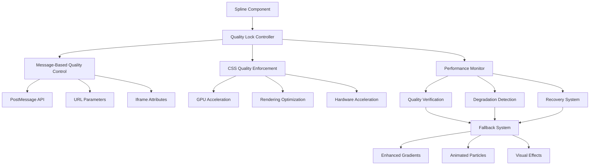

# Design Document

## Overview

The Spline Quality Lock System is a comprehensive solution designed to prevent automatic quality degradation in Spline 3D animations. The system employs multiple layers of quality control including JavaScript-based quality locking, CSS-enforced rendering optimization, performance monitoring without degradation triggers, and intelligent fallback mechanisms.

## Architecture

The system follows a multi-layered architecture with redundant quality control mechanisms:



## Components and Interfaces

### 1. SplineQualityController

The main orchestrator component that manages all quality control operations.

```typescript
interface SplineQualityController {
  // Core quality management
  lockQuality(level: QualityLevel): Promise<boolean>
  verifyQuality(): QualityStatus
  recoverQuality(): Promise<boolean>
  
  // Monitoring and detection
  startMonitoring(): void
  stopMonitoring(): void
  detectDegradation(): boolean
  
  // Fallback management
  activateFallback(): void
  deactivateFallback(): void
  
  // Configuration
  configure(options: QualityControlOptions): void
}

interface QualityControlOptions {
  aggressiveMode: boolean
  monitoringInterval: number
  recoveryAttempts: number
  fallbackThreshold: number
  performanceOptimization: boolean
}
```

### 2. QualityLockManager

Handles the actual quality locking mechanisms through multiple channels.

```typescript
interface QualityLockManager {
  // Message-based control
  sendQualityMessages(iframe: HTMLIFrameElement): void
  sendPeriodicMessages(): void
  
  // URL parameter control
  buildQualityURL(baseUrl: string): string
  
  // Attribute-based control
  setQualityAttributes(iframe: HTMLIFrameElement): void
}

interface QualityMessage {
  type: 'setQuality' | 'disableAutoQuality' | 'forceHighQuality' | 'lockQuality'
  quality?: 'high' | 'ultra' | 'maximum'
  performance?: 'high' | 'maximum'
  enabled?: boolean
  locked?: boolean
}
```

### 3. PerformanceMonitor

Monitors performance without triggering Spline's automatic quality reduction.

```typescript
interface PerformanceMonitor {
  // Monitoring operations
  startMonitoring(iframe: HTMLIFrameElement): void
  getMetrics(): PerformanceMetrics
  
  // Quality verification
  verifyQualityLevel(): QualityLevel
  detectQualityChange(): boolean
  
  // Non-intrusive monitoring
  enablePassiveMonitoring(): void
  disableAutoQualityTriggers(): void
}

interface PerformanceMetrics {
  fps: number
  renderTime: number
  memoryUsage: number
  qualityLevel: QualityLevel
  degradationDetected: boolean
}
```

### 4. CSSQualityEnforcer

Applies CSS-based quality enforcement that works independently of JavaScript.

```typescript
interface CSSQualityEnforcer {
  // CSS application
  applyQualityCSS(element: HTMLElement): void
  enforceGPUAcceleration(): void
  preventBrowserOptimization(): void
  
  // Quality preservation
  lockRenderingQuality(): void
  disableImageCompression(): void
  forceHardwareAcceleration(): void
}
```

### 5. FallbackSystem

Provides enhanced visual alternatives when quality lock fails.

```typescript
interface FallbackSystem {
  // Fallback activation
  activate(): void
  deactivate(): void
  
  // Visual alternatives
  createEnhancedGradient(): HTMLElement
  addAnimatedParticles(): void
  applyVisualEffects(): void
  
  // Transition management
  smoothTransition(fromSpline: boolean): void
}
```

## Data Models

### QualityLevel Enumeration

```typescript
enum QualityLevel {
  ULTRA = 'ultra',
  HIGH = 'high', 
  MEDIUM = 'medium',
  LOW = 'low',
  UNKNOWN = 'unknown'
}
```

### QualityStatus Interface

```typescript
interface QualityStatus {
  current: QualityLevel
  locked: boolean
  stable: boolean
  degradationDetected: boolean
  lastVerified: Date
  recoveryAttempts: number
}
```

### QualityControlConfig

```typescript
interface QualityControlConfig {
  // Aggressiveness settings
  messageFrequency: number // milliseconds
  recoveryAttempts: number
  monitoringInterval: number
  
  // Quality settings
  targetQuality: QualityLevel
  minimumAcceptableQuality: QualityLevel
  
  // Performance settings
  enableGPUAcceleration: boolean
  useHardwareAcceleration: boolean
  preventBrowserOptimization: boolean
  
  // Fallback settings
  fallbackThreshold: number // seconds before fallback
  enhancedFallback: boolean
}
```

## Correctness Properties

*A property is a characteristic or behavior that should hold true across all valid executions of a system-essentially, a formal statement about what the system should do. Properties serve as the bridge between human-readable specifications and machine-verifiable correctness guarantees.*

### Property Reflection

After analyzing all acceptance criteria, several properties can be consolidated to eliminate redundancy:

- Quality lock properties (1.1, 1.2, 1.4) can be combined into a comprehensive quality maintenance property
- Monitoring properties (2.1, 2.4, 8.4) can be consolidated into non-intrusive monitoring property  
- Message control properties (3.1, 3.3, 3.5) can be combined into comprehensive message management property
- CSS enforcement properties (4.1, 4.2, 4.3) can be unified into CSS quality enforcement property
- Recovery properties (6.2, 6.3, 6.4) can be consolidated into comprehensive recovery property

### Core Properties

Property 1: Quality Lock Maintenance
*For any* Spline component instance, when quality lock is activated, the component should maintain high quality settings throughout the entire session regardless of performance fluctuations or automatic reduction attempts
**Validates: Requirements 1.1, 1.2, 1.4**

Property 2: Non-Intrusive Performance Monitoring  
*For any* performance monitoring session, monitoring should collect metrics and track quality without triggering automatic quality adjustments or affecting the rendered quality
**Validates: Requirements 2.1, 2.4, 8.4**

Property 3: Comprehensive Message Management
*For any* iframe load event, the quality controller should send multiple quality lock commands using different protocols and continue sending periodic reinforcement messages with delivery verification
**Validates: Requirements 3.1, 3.3, 3.5**

Property 4: CSS Quality Enforcement
*For any* Spline component, CSS properties should be applied that force high-quality rendering, utilize GPU acceleration when available, and prevent browser-level quality reduction
**Validates: Requirements 4.1, 4.2, 4.3**

Property 5: Quality Persistence Verification
*For any* quality setting application, the system should verify settings remain active for the entire session and log successful quality locks
**Validates: Requirements 1.3, 1.5**

Property 6: Automatic Quality Override
*For any* automatic quality reduction attempt by Spline, the quality controller should override the attempt and disable automatic quality adjustment algorithms
**Validates: Requirements 2.2, 3.4**

Property 7: Performance-Quality Balance
*For any* performance threshold breach, the system should maintain quality while optimizing other aspects and log warnings without reducing quality
**Validates: Requirements 2.3, 2.5**

Property 8: CSS Timing and Persistence
*For any* browser event or iframe loading, CSS quality properties should be applied before content loads and maintained across all browser events
**Validates: Requirements 4.4, 4.5**

Property 9: Fallback System Activation
*For any* quality degradation detection, the fallback system should activate enhanced visual alternatives that match the intended aesthetic and maintain equivalent visual impact
**Validates: Requirements 5.1, 5.2, 5.3**

Property 10: Seamless Mode Transitions
*For any* transition between 3D and fallback modes, the system should provide smooth transitions while continuing restoration attempts during fallback mode
**Validates: Requirements 5.4, 5.5**

Property 11: Comprehensive Quality Recovery
*For any* quality degradation detection, the system should immediately attempt recovery using multiple strategies, log attempt results, and escalate to fallback only after all recovery attempts fail
**Validates: Requirements 6.2, 6.3, 6.4**

Property 12: Continuous Quality Monitoring
*For any* active Spline component, the system should continuously monitor actual rendered quality to detect any quality changes
**Validates: Requirements 6.1**

Property 13: Browser Compatibility Optimization
*For any* browser or device type, the system should detect capabilities, apply appropriate optimizations, and provide consistent quality experience across all supported environments
**Validates: Requirements 7.1, 7.2, 7.3, 7.5**

Property 14: Adaptive Quality Strategy
*For any* detected browser limitations, the system should adjust strategies while maintaining maximum possible quality for that environment
**Validates: Requirements 7.4**

Property 15: Performance Impact Minimization
*For any* quality control operation, the system should operate with minimal CPU and memory overhead without impacting page load times while optimizing for performance efficiency
**Validates: Requirements 8.1, 8.2, 8.3**

Property 16: Quality-Performance Balance
*For any* system operation, quality maintenance should be balanced with overall application performance to ensure optimal user experience
**Validates: Requirements 8.5**

<function_calls>
<invoke name="prework">
<parameter name="featureName">spline-quality-lock-system

## Error Handling

### Quality Lock Failures
- **Timeout Errors**: If quality lock messages fail to be acknowledged within 5 seconds, retry with alternative message formats
- **Browser Compatibility**: If PostMessage API is not supported, fall back to URL parameter and CSS-only quality control
- **Iframe Access Errors**: If iframe content cannot be accessed due to CORS, rely on CSS enforcement and URL parameters

### Performance Monitoring Errors
- **Monitoring Failures**: If performance monitoring fails, continue with quality lock but disable performance-based optimizations
- **Metric Collection Errors**: If performance metrics cannot be collected, use time-based quality verification instead
- **Memory Constraints**: If monitoring causes memory issues, reduce monitoring frequency or disable non-essential metrics

### Recovery System Errors
- **Recovery Timeout**: If quality recovery attempts exceed 30 seconds, activate fallback system
- **Multiple Recovery Failures**: If 3 consecutive recovery attempts fail, switch to fallback mode and reduce recovery frequency
- **Fallback Activation Errors**: If fallback system fails to activate, maintain current state and log critical error

### Graceful Degradation Strategy
1. **Primary**: Full quality lock with monitoring and recovery
2. **Secondary**: CSS-only quality enforcement with basic monitoring  
3. **Tertiary**: Enhanced fallback with continued recovery attempts
4. **Final**: Basic fallback with minimal quality control

## Testing Strategy

### Dual Testing Approach
The system requires both unit testing and property-based testing for comprehensive coverage:

- **Unit tests**: Verify specific quality control scenarios, error conditions, and browser compatibility
- **Property tests**: Verify universal properties across all quality control operations and browser environments

### Property-Based Testing Configuration
- **Testing Library**: fast-check for TypeScript/JavaScript property-based testing
- **Test Iterations**: Minimum 100 iterations per property test
- **Test Environment**: Multiple browser engines (Chromium, Firefox, Safari)
- **Performance Testing**: Automated performance regression testing

### Unit Testing Focus Areas
- **Quality Lock Mechanisms**: Test specific quality lock scenarios and edge cases
- **Browser Compatibility**: Test quality control across different browser engines
- **Error Recovery**: Test specific error conditions and recovery scenarios
- **Performance Impact**: Test system overhead and performance optimization

### Property Testing Focus Areas
- **Universal Quality Maintenance**: Test quality preservation across all scenarios
- **Cross-Browser Consistency**: Test consistent behavior across browser environments
- **Performance Characteristics**: Test performance impact across different system loads
- **Recovery Reliability**: Test recovery success rates across various failure scenarios

### Test Tag Format
Each property test must reference its design document property:
**Feature: spline-quality-lock-system, Property {number}: {property_text}**

Example:
```javascript
// Feature: spline-quality-lock-system, Property 1: Quality Lock Maintenance
test('quality lock maintains high settings throughout session', () => {
  // Property-based test implementation
});
```

### Integration Testing
- **End-to-End Quality Verification**: Test complete quality lock lifecycle in real browser environments
- **Performance Impact Testing**: Measure actual performance impact on page load and runtime
- **Cross-Device Testing**: Verify quality control on mobile, tablet, and desktop devices
- **Network Condition Testing**: Test quality control under various network conditions

The testing strategy ensures that the Spline Quality Lock System maintains reliable quality control across all supported environments while minimizing performance impact.